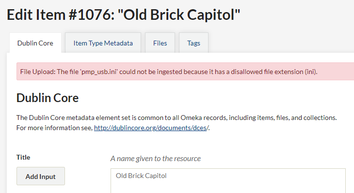
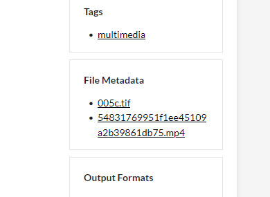

# Files

When adding [items](Items.md) to your database, often you will upload one or more files (images, documents, etc.) associated with that item. An item can have as many files attached as you wish, or none. 

Omeka Classic does not offer a way to upload files that are not attached to an item, except [depending on the theme](../Admin/Appearance/Themes.md#configuring-a-theme) some branding files such as a header background or logo file.

File types
-------------------------------------------------------------

Omeka Classic accepts most common files and file types, and can be customized to accept or reject file types of your choice. You may wish to [format your multimedia files](#multimedia-files) according to what can best be embedded and streamed in modern browsers.

If you are having difficulty or are seeing file-validation errors, please see more information about adjusting the accepted file types and extensions in [File Validation section of the Security Settings page](../Admin/Settings/Security_Settings.md#file-validation).

File display order
---------------------------------------------------------------
If you have multiple files added to an item, you may click and drag the files into the preferred display order for both public and admin item pages.

The first file associated with an item will be used as its thumbnail in browsing and searching, as well as on timelines and in other features added by plugins.

Files with thumbnails
-------------------------------
Thumbnail images are automatically created for many file types as of Omeka 2.0, including thumbnails from the first frame of videos. 

Derivative images are derived as follows:

- A square thumbnail, used most commonly on browsing pages and in search results. This will clip the longer side of an image (centered) to the same length as the shorter side.
- An original-dimension thumbnail. You can choose to use square or original-dimension thumbnails on the Settings tab of the [Appearance page](../Admin/Appearance/Appearance_Settings.md).
- A "full-size" image used on file view pages, default 800px on its longest side.
- The original-sized image as uploaded, available for download or viewing on file view pages.

You can control the size of each thumbnail generated (square thumbnails and small original-dimension thumbnails, as well as full-size images) on the Settings tab of the [Appearance page](../Admin/Appearance/Appearance_Settings.md#derivative-size-constraints).

You can use the [Derivative Images plugin](../Plugins/DerivativeImages.md) to re-generate thumbnails for uploaded media if needed.

Items without attached files can display a default thumbnail rather than no thumbnail. 

Thumbnail creation relies on the ability of your chosen thumbnail utility (the default being ImageMagick) and which file types it can process. If you have access to the `config.ini` file, you can manage [thumbnail configuration](../Technical/ConfiguringThumbnailCreation.md). 

Look up the utility you are using (such as [ImageMagick](https://imagemagick.org/){target=_blank}, [Imagick](https://www.php.net/imagick){target=_blank}, or [GD](https://www.php.net/manual/en/intro.image.php){target=_blank}) to find out which file types it supports. 

File size limitations
-----------------------------

Omeka Classic imposes no file size limitations. Your server, however, may have restrictions on file upload sizes or speeds that may be causing problems. These limitations vary from server to server and we cannot change this for you. If you have a problem uploading files through the "Add New Files" interface, please first check with your hosting service or your local server administrator. 

Batch-add files
---------------------------------------------------------------

To upload more than one file at a time, you may download and install add-ons such as the [Dropbox plugin](../Plugins/Dropbox.md). It allows you to upload multiple files from Dropbox directly into a folder on your server, which you can then add in the items interface. 

File metadata
--------------------------------------------------------------
You may add a distinct set of Dublin Core metadata for each file uploaded.

To add metadata, click the "Edit" button found to the right of the file name in `admin/items/edit`. You also may view or edit file metadata from the `admin/items/show` screen by clicking the file name under the heading "File Metadata."

Alt text
----------------------
If a file does not have any metadata, as you can see in the above screenshot, Omeka uses the filename as alt text. If the file has information in its Dublin Core Title property, that text will be displayed as the alt text for that file wherever it appears on the site. 

Multimedia files
------------------------
As of version 2.4, Omeka Classic uses HTML 5 audio and video tags when embedding audio and video. This means generally better support on newer browsers, but worse support on older ones and for older video formats especially.

By choosing from a few well-supported formats for audio and video files, you can provide a much better experience for your users across different platforms and devices.

### Images

#### TIFF
TIFF files are not supported for display in most browsers. TIFFs can be ingested into Omeka Classic, where they will have derivative images generated in JPG format. The original TIFFs will be provided for download anywhere that Omeka calls the 'original' file. The JPGs will be displayed anywhere Omeka calls the 'fullsize', 'medium', or thumbnail images. This may depend on the theme.

### Video
#### MP4
The MP4 container (.mp4 or .m4v) is the best-supported video format across browsers and platforms. By far the best choice for video that will work well across different browsers are .mp4 files with H.264 video and AAC audio.

.mp4 files can contain other types of video (or audio), including newer ones like H.265, and older ones like MPEG-4 Visual. Any video codec other than H.264 has **much** worse browser support.

#### Other formats
The WebM (.webm) container with VP8 or VP9 video is supported by several browsers, but Internet Explorer and Safari are notable and significant exceptions.

The Ogg (.ogg, .ogv) container and Theora video are supported by some browsers, but there is little support among mobile browsers and no support at all on IE or Safari.

### Audio

#### MP3
MP3 (.mp3) is one of the most common formats for compressed audio, and it enjoys wide support across browsers and from desktop to mobile.

#### AAC

AAC is a somewhat newer format than MP3, but it also is well supported in most browsers. The widest support is for AAC in an MP4 container (this usually carries the file extension .m4a), with somewhat lesser support for other containers and formats (often found with a .aac extension).

#### Other formats

WAV or WAVE (.wav) audio is supported by most browsers (with the notable exception of Internet Explorer). The major downside for use on the Web is that WAV audio is uncompressed, so it takes up vastly more storage space and bandwidth than the compressed formats listed above. If feasible, it’s best to use one of those instead of WAV.

Ogg Vorbis audio (.ogg, .oga) is a compressed format like MP3 and AAC, but it has much less widespread support. Expect Vorbis audio to only work on Firefox, Chrome, and Android.

Opus (.opus) is one of the newer available audio formats. For the time being, it has a similar problem as Vorbis: a lack of support among browsers, but there are signs that Opus could gain more support in the future.

### Legacy formats
There are a lot of media files out there that aren’t in any of the formats listed here. With certain add ons or on certain platforms (like Safari on the Mac in many cases), it can be possible to embed some of those files with HTML 5, but expect many or most users to be unable to play them. Browser plugins can also play many file types, but browsers are steadily reducing and removing their support for these kinds of plugins.

For old media, often the best choice is to just present a download link so the viewer can play or convert the file locally. This is what Omeka does when it doesn’t recognize a file type or when a browser reports that it can’t play a file.

File formats which result in a download link, rather than an embedded playback, include: 

- Video: .avi, .wmv
- Audio: .aiff (except Safari), .midi, .wha

If you do not see a format listed here that you think should be, try it out and let us know the results.
